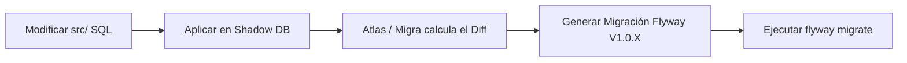

# Estándar de Ingeniería de Base de Datos y Seguridad (v2)

Este documento define el estándar arquitectónico, de seguridad y rendimiento para la base de datos PostgreSQL 16 y su integración con el backend Laravel. Todo desarrollo realizado por humanos o agentes de IA en este repositorio debe cumplir estrictamente con estas reglas.

---

## 1. Arquitectura de Esquemas Físicos (Namespaces)

Para evitar un esquema monolítico saturado y confuso, la base de datos se estructura en **esquemas físicos de PostgreSQL** que actúan como límites lógicos de dominio (Domain-Driven Design a nivel de base de datos):

*   **`auth`**: Seguridad, autenticación, usuarios, roles, permisos y sesiones.
*   **`academic`**: Estructuras educativas: cursos, syllabus, temas, subtemas, semanas, ciclos y universidades.
*   **`questions`**: Banco de preguntas, alternativas, digitalización de imágenes de soluciones e integraciones de IA.
*   **`materials`**: Materiales de clase, PDFs finales, balotas por periodos y plantillas de configuración.
*   **`exams`**: Exámenes, áreas de evaluación, claves y estadísticas de rendimiento.
*   **`organization`**: Estructura de la organización: compañías (clientes), empleados, docentes, sedes y aulas.
*   **`audit`**: Tablas y triggers destinados al registro histórico de cambios (auditoría).
*   **`public`**: Reservado exclusivamente para extensiones globales y utilidades transversales sin lógica de negocio.

---

## 2. Nomenclatura Estricta

### A. Tablas y Columnas
*   **Tablas**: `snake_case` y en plural (ej. `auth.users`, `academic.courses`).
*   **Tablas Intermedias (N:M)**: Nombre de las dos tablas combinadas en orden alfabético o lógico de dependencia (ej. `auth.roles_permissions`).
*   **Primary Keys (PK)**: Siempre columna `id` de tipo `UUID` (preferido para resiliencia y seguridad en sistemas distribuidos) o `BIGSERIAL`.
*   **Foreign Keys (FK)**: Nombre de la tabla referenciada en singular seguido de `_id` (ej. `course_id`). Deben tener un índice asociado de forma obligatoria para optimizar los `JOINs`.
*   **Timestamps**: `created_at` y `updated_at` de tipo `TIMESTAMPTZ`.
*   **Soft Deletes**: Columna `deleted_at` de tipo `TIMESTAMPTZ` únicamente en tablas críticas de negocio que requieran recuperación de información.

### B. Prefijos de Objetos SQL
*   **Funciones**: `fn_` seguido del verbo y el dominio/entidad (ej. `fn_create_user`, `fn_list_courses_by_employee`).
*   **Procedimientos**: `sp_` para procesos batch o transaccionales que requieran gestión interna de transacciones (`COMMIT`/`ROLLBACK`).
*   **Triggers**: `trg_` seguido de la tabla y la acción (ej. `trg_audit_users`).
*   **Vistas**:
    *   Estándar: `vw_` (ej. `vw_active_teachers`).
    *   Materializadas: `mv_` (ej. `mv_exam_usage_stats`).
*   **Índices**:
    *   B-Tree estándar: `idx_nombretabla_columnas` (ej. `idx_users_email`).
    *   Único: `uq_nombretabla_columnas` (ej. `uq_users_document`).
    *   Llave foránea: `fk_nombretabla_tablaorigen` (ej. `fk_courses_company_id`).

---

## 3. Estándar de Funciones y Volatilidad (PL/pgSQL)

### A. Verbos de Funciones (Strict)
*   **Lectura (STABLE)**:
    *   `get`: Retorna exactamente 1 registro o fila (arroja error o NULL si no existe).
    *   `list`: Retorna un conjunto de filas (N filas) sin paginar.
    *   `paginate`: Retorna un subconjunto de filas con metadatos de paginación (offset, limit, total).
    *   `search`: Retorna filas filtradas dinámicamente.
    *   `count`: Retorna un entero.
    *   `exists` / `is` / `has` / `can`: Retorna un booleano.
*   **Escritura (VOLATILE)**:
    *   `create` / `update` / `delete`: Operaciones estándar de escritura.
    *   `archive`: Soft delete (cambio de estado / `deleted_at`).
    *   `restore`: Revierte un soft delete.
    *   `upsert`: Inserta o actualiza en conflicto.
*   **Lógica / Procesamiento (VOLATILE / IMMUTABLE)**:
    *   `calculate`: Operaciones matemáticas puras (debe ser `IMMUTABLE` si no consulta tablas).
    *   `process` / `sync`: Flujos lógicos complejos y sincronización de datos.
    *   `approve` / `reject` / `assign`: Transiciones de estado de negocio.

### B. Reglas de Volatilidad
1.  **`IMMUTABLE`**: No puede modificar ni leer la base de datos. Ante los mismos argumentos, siempre retorna el mismo valor (ej. formateo de texto, cálculos matemáticos puros). Permite al planificador de consultas cachear el resultado.
2.  **`STABLE`**: No puede modificar la base de datos. Puede realizar lecturas (SELECT). Garantiza retornar los mismos resultados dentro de la misma transacción para los mismos parámetros.
3.  **`VOLATILE`**: Puede modificar datos (INSERT, UPDATE, DELETE). Se ejecuta para cada fila evaluada y no puede ser optimizada mediante caché por el planificador de consultas.

### C. Retornos Estrictos
*   **NUNCA** utilices `SETOF record`. Requiere definir los tipos al invocar la función, lo cual acopla innecesariamente el backend.
*   Utiliza siempre `RETURNS TABLE(columna tipo, ...)` para retornos multi-columna o tipos compuestos (`RETURNS auth.users`).

---

## 4. Seguridad de Base de Datos y Vulnerabilidades

### A. Prevención de SQL Injection (Crítico)
*   **SQL Dinámico en PL/pgSQL**: Si construyes consultas SQL como strings dentro de funciones usando `EXECUTE`, **NUNCA** concatenes parámetros directamente con `||`. Utiliza siempre la cláusula `USING` para inyectar parámetros de forma segura:
    ```sql
    -- INCORRECTO (Vulnerable a SQL Injection)
    EXECUTE 'SELECT * FROM auth.users WHERE name = ''' || p_name || '''';

    -- CORRECTO (Seguro, utiliza bindings)
    EXECUTE 'SELECT * FROM auth.users WHERE name = $1' USING p_name;
    ```
*   **En Laravel**: Utiliza siempre Eloquent o Query Builder con bindings de parámetros. Si es estrictamente necesario usar `DB::raw()`, asegúrate de pasar los parámetros en un array secundario, nunca concatenes variables directamente en la cadena SQL.

### B. Principio de Menor Privilegio (Least Privilege)
*   La conexión de la aplicación backend (Laravel) **no debe usar el superusuario `postgres`**.
*   Se debe definir un rol de usuario restringido de aplicación (ej. `odiseo_app`) que solo tenga permisos de ejecución (`EXECUTE`) en el esquema de interfaz o permisos mínimos de lectura/escritura (`SELECT, INSERT, UPDATE, DELETE`) en los esquemas de tablas, previniendo alteraciones al DDL (no `ALTER`, no `DROP` en producción).

### C. Seguridad a Nivel de Fila (Row-Level Security - RLS)
*   Para datos altamente confidenciales o arquitecturas multi-tenant, se deben activar políticas de RLS en PostgreSQL para asegurar que un cliente o usuario solo pueda leer filas que le correspondan, incluso si la consulta SQL del backend carece de un filtro `WHERE company_id = X`.
    ```sql
    ALTER TABLE organization.employees ENABLE ROW LEVEL SECURITY;
    CREATE POLICY employee_tenant_isolation ON organization.employees
        USING (company_id = current_setting('app.current_company_id')::uuid);
    ```

---

## 5. Rendimiento, Consultas e Índices

### A. Consulta de Datos
*   **SELECT explícito**: Especifica siempre las columnas deseadas. Evita `SELECT *` para reducir la transferencia de red y permitir que el optimizador utilice índices de cobertura (*Index-Only Scans*).
*   **Filtros de Fechas**: Evita aplicar funciones sobre columnas indexadas de tipo timestamp en el `WHERE` (ej. `WHERE EXTRACT(YEAR FROM created_at) = 2026`), ya que invalida el uso del índice. Utiliza rangos en su lugar:
    ```sql
    -- CORRECTO
    WHERE created_at >= '2026-01-01 00:00:00+00' AND created_at < '2027-01-01 00:00:00+00'
    ```
*   **Evitar `BETWEEN` en marcas de tiempo**: `BETWEEN` es inclusivo en ambos extremos. En marcas de tiempo con milisegundos, esto puede incluir registros del día siguiente a las `00:00:00`. Usa siempre `>=` y `<`.
*   **UNION vs UNION ALL**: Utiliza `UNION ALL` por defecto. `UNION` realiza una operación implícita de ordenamiento y deduplicación en memoria que degrada el rendimiento.

### B. Optimización de Relaciones (N+1)
*   En Laravel, utiliza siempre carga ansiosa (*Eager Loading* con `with()`) para evitar consultas redundantes en bucles.
*   En SQL puro, resuelve relaciones uno a muchos complejas utilizando `LATERAL JOIN` o expresiones tipo `JSONB` agregadas en subconsultas para retornar estructuras jerárquicas en un solo viaje de red.

---

## 6. Flujo de Trabajo y Migraciones Declarativas

Para garantizar la sincronización limpia de la base de datos entre el código local y los entornos de producción sin perder el control de la estructura declarativa de Git, se promueve el uso de **Migraciones Declarativas**:



### ¿Qué son las Migraciones Declarativas y cómo funcionan?
En lugar de escribir manualmente engorrosos archivos de migración incrementales que alteran tablas, el desarrollador (o agente de IA) modifica directamente los archivos fuente declarativos en `src/` (ej. agregar una columna en `src/academic/tables/course.sql`).

Luego, herramientas modernas como **Atlas DB** (atlasgo.io) o **Migra** automatizan el proceso:
1.  **Shadow DB**: Levanta una base de datos temporal vacía en Docker.
2.  **Compilación**: Carga todos los archivos actuales de `src/` en la base de datos temporal.
3.  **Comparación (Diff)**: La herramienta compara el esquema resultante de la Shadow DB con tu base de datos local o de producción actual.
4.  **Generación de Script**: Genera de forma automatizada un script incremental limpio y preciso (ej. `migrations/V1.0.2__add_column_to_course.sql`) para Flyway.
5.  **Despliegue**: Flyway ejecuta este script generado de forma segura en producción.

Esto combina lo mejor de dos mundos: mantienes tus archivos fuente SQL perfectamente organizados y modulares en carpetas por dominios en tu repositorio de Git, y sigues disponiendo de migraciones secuenciales estrictas para tus despliegues.